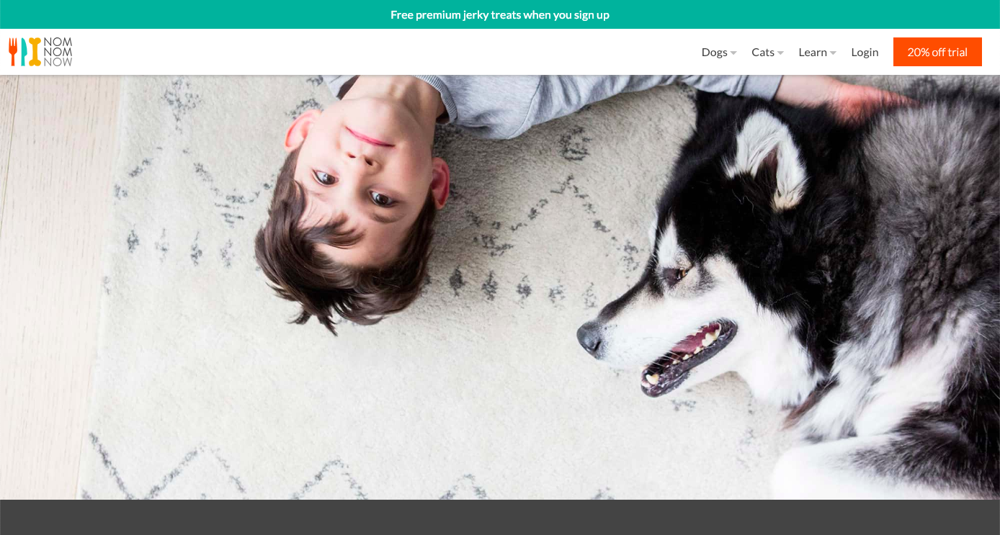
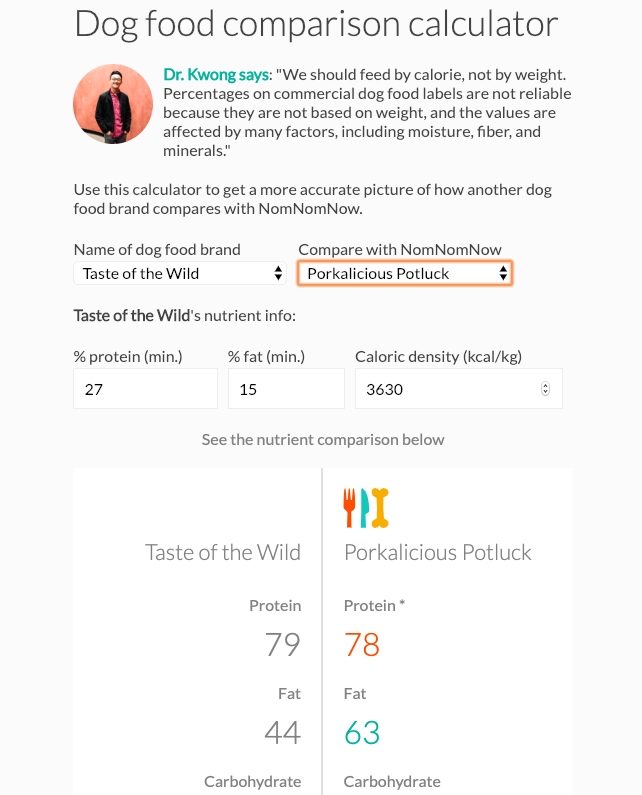

# NNN-Exercise

Fresh food for dogs and cats, delivered - NomNomNow

## Exercises

### 1) Site Navigation Menu

  - Visit nomnomnow.com and observe how the top navigation menu works.
  - Reimplement the navigation menu using Javascript + CSS + HTML. Use vanilla Javascript and ES5 syntax. No third-party libraries.
  - Make a [page](https://nomnomnow-top-nav-warrenkwong.netlify.com/) to demo functionality.

##### Demo Preview

### 2) Dog Food Comparison Calculator

  - Visit https://www.nomnomnow.com/site/nutrient-calculator and play around with the existing calculator.
  - Look up the nutrition info for three popular dog kibble products
  - Use ReactJS + HTML + CSS to reimplement the comparison calculator as dropdown menus instead of text input fields
    - First dropdown should contain the 3 popular kibble brands
    - Second dropdown should be the same set of 4 NomNomNow recipes
    - Use the following formulas for converting percentage values to grams:
      - Grams protein = (% protein + 1.5) / (kcal per kg / 10000)
      - Grams fat = (% fat + 1) / (kcal per kg / 10000)
      - Grams carbs = (1000 - (grams protein * 3.5) - (grams fat * 8.5))/3.5
      - If grams carbs is less than 0, set value to 0.
  - Make a [page](https://nomnomnow-dog-food-comparision-calculator-warrenkwong.netlify.com/) to demo functionality.

##### Demo Preview

